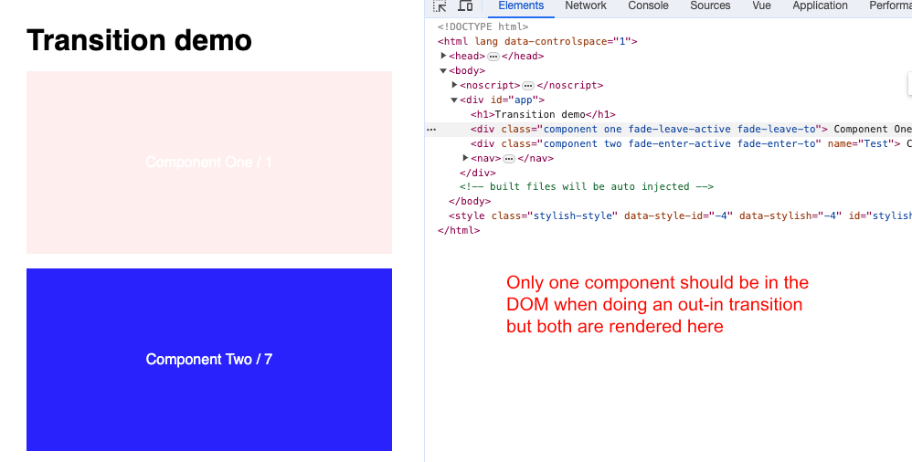

# Vue Transition Bug Demo

## Problem

Very strange bug in Vue 2.x.

My out-in page transitions have been working perfectly for a long time, recently I noticed it has stopped working and the behaviour is in/out.

So before, a page would fade out then the new page would fade in. Now, it cross-fades (in/out behaviour) and because both pages are in the DOM at the same time, 1) they stack and 2) as the old one is removed, it suddenly jumps to the top of the page:

No code changes at my end. The only things I can think it might be:

- only-recently updated dependency revealing the bug
- out of date transition classes with Vue 2.7 (have added .fade-enter-from)
- some issue with transition events not being fired or picked up (Chrome bug?)

## Vue 2

This repo is a minimal reproduction.

The bug seems to happen occasionally; there's not a pattern to it.

I have observed it when:

- the `App` source code is edited
- the app has been left for a long time

You can click the links or navigate history to see it.

## Vue 3

Online example (working) for Vue 3:

https://play.vuejs.org/#eNqtVE1v2zAM/SuCd+gGNE4/sB60dsM29LAd1mHr0RfFph21siRItJOgyH8fJfkjXbtih14MiXx8fJRJPmSfrc37DjKeXfrSSYvMA3b2Y6Fla41D9sAc1GzPamdadkTQo8l1o2Ew50s6B57Zebsxk5POg7PQpdGekqBAYFeB+20tlId3hb5cJgWUmy4IrVUEohtjl5XsWamE91dFRgwopAZXZNFJbnRCe4nSaKZFCwSqRQVFxlpThZvpcCH1hKeI0pBMDRoZl4E0CfoUa+JBPAUvR/rlzJ/kLElPOimxAjXipLYdMtzZkLNcQ3m/Mlsi6hdBhxrTRGp2a5pGQaIbWSjTXHZ8Bo87FS75VPVxvIzqHwIBlafIxdmp3bJK+DVU7M3FxcWHQu8Dyxyc8GuQzRoJ/v7EbglEDD24WpkNZ6JDcxD3KE8lPYnbcVYrSHFCyUYvJKn2nJUEBBftd51HWe8WITFZH/k2ssI1Z2cnY/JRzmwpjTKOs82amKOhFa6RmhQ7aCd1pCzpWonyvnGm0xWnjqomAFIPPgGsVJc4p1cY0qaY0DiLKHYhSpQ9hPeORgWih8GYaOe24MxYUUrcsdP83D9DNrEk6jAZfxHjoHUg4iw/Szw0F7EJsuMMPT1oLZv8zhtNMxsDwkS0VipwNzZo8UXGE1XwCUW/9Xu0oetCNcke2/MZ+52njuV0+OnAg+upWycf0l8ATO7r3z9gS+fJSS3eUT+/5PwF3qguaEywL/RDSPYBLqr9FjeI1M2tv95S+/ixqCA0IPcRX2S0U76+UPos9zw/j3H0nvSKw656svP+fwGNU0HfaamQEmOjlfgPt8Sjoab0wzZ8hfTU34fpB2tYXv9Mv/8DNeQHNw==
